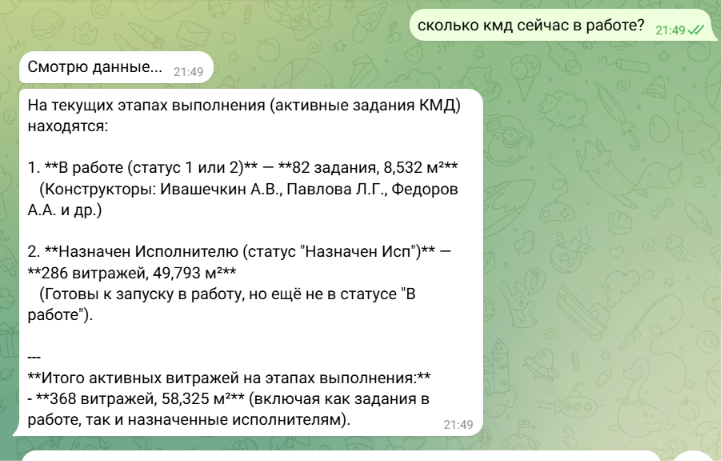
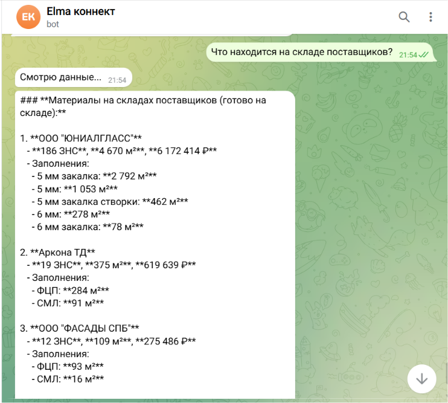
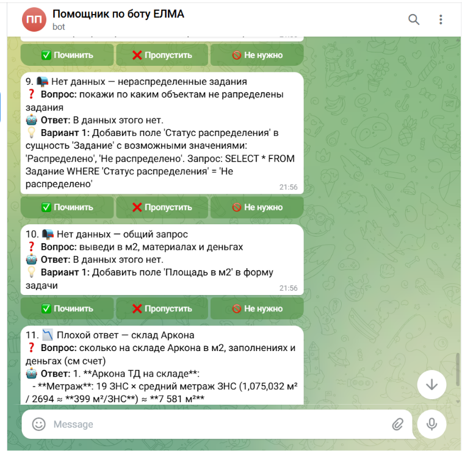

# ELMA Assistant — AI-помощник по данным ELMA365

Telegram-бот, который отвечает на вопросы сотрудников по данным из корпоративной системы ELMA365 на русском языке. Часть большой системы аналитики и автоматизации на базе ELMA365 API.

---

## Проблема

Данные в ELMA365 разрозненны: тендеры, задания КМД, заказы, снабжение, договоры, бюджеты, документы — всё в разных разделах. Чтобы получить ответ, нужно вручную искать по нескольким экранам. Встроенная отчётность ELMA слабая и не закрывает потребности команды. Нет единой точки входа для получения информации.

---

## Что умеет (MVP)

- Принимает вопросы на русском языке в Telegram
- Роутер автоматически определяет категорию запроса
- Субагенты отвечают по своим блокам данных:
  - **КМД** — задания на конструкторскую и монтажную документацию
  - **Снабжение** — заявки на снабжение (ЗНС), статусы, даты поставки
- Данные обновляются по расписанию, по запросу или в комбинированном режиме
- Хранит историю переписки в SQLite

**В планах:** BI-аналитика, дашборды по запросу, Excel-отчёты, охват всех отделов компании.

---

## Аудитор

Отдельный служебный бот (`@Helper_elma_bot`) для контроля качества:

- Раз в час анализирует ответы основного бота
- Находит проблемы: неверная категория, пустые ответы, ошибки роутера
- Отправляет отчёт администратору с кнопками **Починить / Пропустить**

---

## Архитектура

```
ELMA365 API
    │
    ▼
Локальный кэш (JSON) ◄── обновление по расписанию / по запросу
    │
    ▼
Telegram-бот
    │
    ▼
Роутер (Groq AI) — определяет категорию вопроса
    │
    ├── Субагент КМД
    └── Субагент Снабжение
    │
    ▼
Ответ пользователю в Telegram

    + Аудитор (фоновый процесс) — мониторинг качества ответов
```

---

## Скриншоты

### Основной бот — вопрос по КМД


### Основной бот — вопрос по снабжению


### Аудитор — отчёт с кнопками


---

## Технологии

| Компонент | Технология |
|-----------|-----------|
| Язык | Python 3.12+ |
| Telegram | python-telegram-bot |
| AI / роутер | Groq AI |
| База истории | SQLite |
| Данные | ELMA365 REST API |
| Хранение данных | JSON-кэш (локально) |

---

## Запуск

**1. Клонировать репозиторий**
```bash
git clone https://github.com/vsermus/elma-assistant.git
cd elma-assistant
```

**2. Установить зависимости**
```bash
pip install -r requirements.txt
```

**3. Создать `.env`** (на основе `.env.example`)
```
ELMA_TOKEN=...
TELEGRAM_BOT_TOKEN=...
ADMIN_BOT_TOKEN=...
ADMIN_CHAT_ID=...
OLLAMA_API_KEY=...
```

**4. Загрузить данные из ELMA**
```powershell
.\scripts\run.ps1 load
```

**5. Запустить основной бот**
```bash
python bot/telegram_bot.py
```

**6. Запустить аудитора** (опционально)
```bash
python bot/admin_bot.py
```

---

## Структура проекта

```
ELMA_Connector/
├── bot/
│   ├── telegram_bot.py      # Основной бот
│   ├── admin_bot.py         # Аудитор
│   ├── core/
│   │   ├── aggregator.py    # Роутер запросов
│   │   ├── auditor.py       # Логика аудита
│   │   └── agent_manager.py # Управление субагентами
│   └── agents/              # Инструкции субагентов (KMD, снабжение)
├── scripts/
│   ├── load/                # Загрузка данных из ELMA365
│   └── run.ps1              # Точка входа для типовых задач
├── config/
│   └── entities.json        # Список запросов к ELMA365 API
├── dashboards/              # Готовые HTML-дашборды
└── .claude/
    ├── agents/              # Кастомные агенты Claude Code
    └── skills/              # Скиллы Claude Code
```

---

## Статус проекта

| Компонент | Статус |
|-----------|--------|
| Основной бот (КМД + снабжение) | ✅ Работает |
| Аудитор | ✅ Работает |
| Загрузка данных из ELMA | ✅ Работает |
| HTML-дашборды | ✅ Готовы |
| Excel-отчёты по запросу | 🔄 В планах |
| BI-аналитика и дашборды по запросу | 🔄 В планах |
| Охват всех отделов | 🔄 В планах |

---

## Автор

**Виктор Сермус** — аналитик данных  
GitHub: [vsermus](https://github.com/vsermus)
